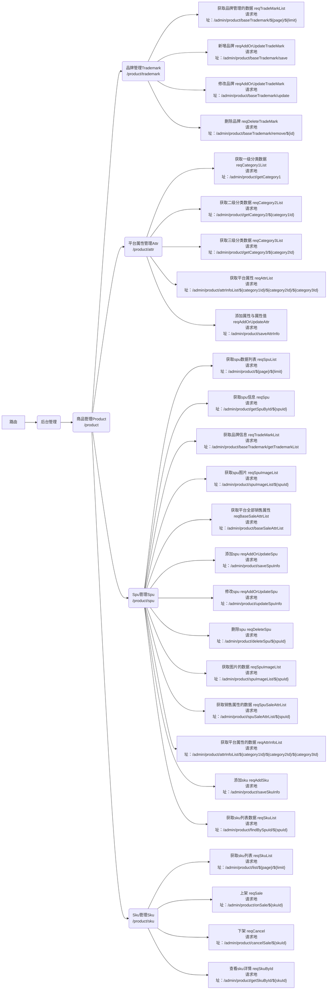

## Build Setup

```bash
# 进入项目目录
cd houtaiguanli

# 安装依赖
npm install

# 建议不要直接使用 cnpm 安装以来，会有各种诡异的 bug。可以通过如下操作解决 npm 下载速度慢的问题
npm install --registry=https://registry.npm.taobao.org

# 启动服务
npm run dev
```

## 文件介绍

```bash
build
     ----index.js
mock
    ----mock数据的文件夹

node_modules
     ------项目依赖的模块

public
     ------ico图标,静态页面，publick文件夹里面经常放置一些静态资源，而且在项目打包的时候webpack不会编译这个文件夹，原封不动的打包到dist文件夹里面

src
    ------api文件夹:涉及请求相关的
    ------assets文件夹：里面放置一些静态资源（一般共享的），放在aseets文件夹里面静态资源，在webpack打包的时候，会进行编译
    ------components文件夹：一般放置非路由组件获取全局组件
    ------icons这个文件夹的里面放置了一些svg矢量图
    ------layout文件夹：他里面放置一些组件与混入
    ------router文件夹：与路由相关的
    -----store文件夹：一定是与vuex先关的
    -----style文件夹：与样式先关的
    ------utils文件夹：request.js是axios二次封装文件****
    ------views文件夹：里面放置的是路由组件

App.vue:根组件
main.js：入口文件
.env.development
.env.producation
```

## 后台路由


后台管理系统接口文档地址：http://39.98.123.211:8510/swagger-ui.html#/




